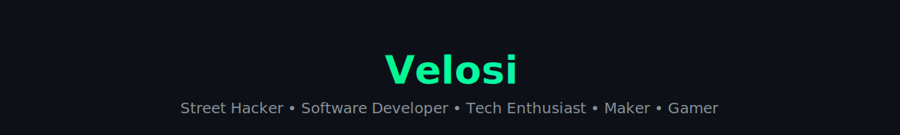

  

  
  
  
  
  
  
  
  

  

  

  

  

 
<h2 align="center"></h2>

<h3 align="center">⚔️ Elite Pokémon Team</h3>

  Classic • Ghost & Dark oriented • Tactical balance

<table align="center">
  <tr>
    <td align="center"style="background: radial-gradient(circle at top, #2b1b4d 0%, #161b22 65%);border: 2px solid #7b5cff;border-radius: 14px;padding: 10px;box-shadow:0 0 18px rgba(123,92,255,0.6),inset 0 0 10px rgba(123,92,255,0.25);">
      
     <b>Gardevoir</b> 
      Support / Sp.Atk 
      ---ACTIVE---
    </td>
    <td align="center">
       
      <b>Lopunny</b> 
      Physical Sweeper
    </td>
    <td align="center">
       
      <b>Umbreon</b> 
      Tank / Stall
    </td>
    <td align="center">
       
      <b>Zoroark (H)</b> 
      Mind Games
    </td>
    <td align="center">
       
      <b>Meowscarada</b> 
      Speed Control
    </td>
    <td align="center">
       
      <b>Ceruledge</b> 
      Late Game Closer
    </td>
  </tr>
</table>

  
  
  
  
  
  

  
<b>🔍 View detailed Pokémon ↔ Tech mapping</b>

 

<table>
  <tr>
    <th>Pokémon</th>
    <th>Tech / Skill</th>
    <th>Why</th>
  </tr>
  <tr>
    <td>🧠 <b>Gardevoir</b></td>
    <td>AI · Python</td>
    <td>Prediction, analysis, decision-making</td>
  </tr>
  <tr>
    <td>🐰 <b>Lopunny</b></td>
    <td>UI / UX</td>
    <td>Speed, fluidity, user-focused design</td>
  </tr>
  <tr>
    <td>🌑 <b>Umbreon</b></td>
    <td>Cyber Security</td>
    <td>Defense, resilience, risk management</td>
  </tr>
  <tr>
    <td>🎭 <b>Zoroark (H)</b></td>
    <td>Reverse Engineering</td>
    <td>Deception, abstraction, deep analysis</td>
  </tr>
  <tr>
    <td>🌿 <b>Meowscarada</b></td>
    <td>Automation</td>
    <td>Fast solutions, efficiency</td>
  </tr>
  <tr>
    <td>🔥 <b>Ceruledge</b></td>
    <td>Performance Optimization</td>
    <td>Maximum impact at the right moment</td>
  </tr>
</table>

 

  

  
  

